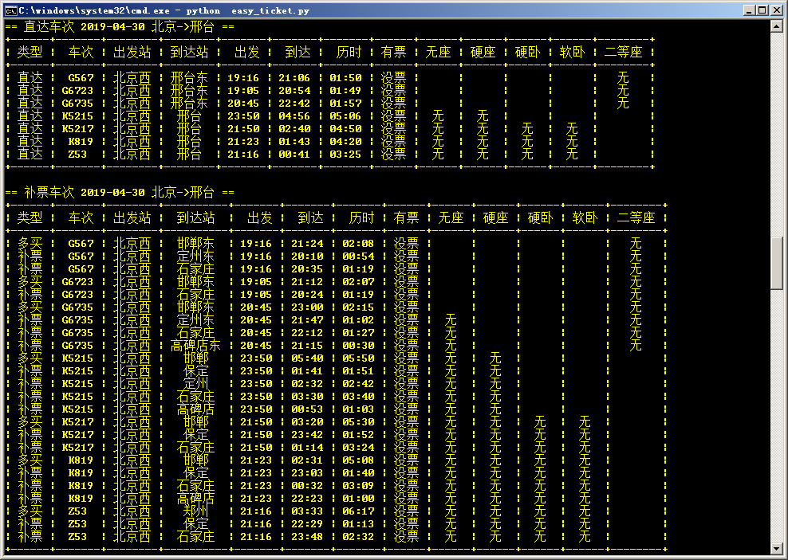

## 功能
搜索直达火车车次以及可以上车补票的车次

## 查询结果



## 外部包
```
requests
PrettyTable
```

## 配置修改

### 修改展示结果
```
self.tableColumn = {
    'type':'类型',
    'train_id':'车次',
    'search_start':'出发站',
    'search_end':'到达站',
    'time_setout':'出发',
    'time_arrived':'到达',
    'time_travel':'历时',
    'have_ticket':'有票',
    'wuzuo':'无座',
    'yingzuo':'硬座',
    'yingwo':'硬卧',
    'ruanwo':'软卧',
    '2dengzuo':'二等座',
    # '1dengzuo':'一等座',
    # 'shangwu':'商务座'
}
```

### 修改查询参数
```
ticket.addsearch({
    'train_date':'2019-04-30',              #乘车日期
    'from_station':station.name2id('北京'), #起始站
    'to_station':station.name2id('邢台'),   #到达站
    'purpose_codes':'ADULT'                 #成人票
},{
    #正则匹配，有至少一项匹配就展示
    # 'train_id':['Z53','K819'],
    #'time_setout':[],
    #'time_arrived':[],
    #'have_ticket':['Y','N'],
    #'wuzuo':[],
    #'yingzuo':[],
    #'2dengzuo':[],
},{
    #发车时间和到达时间的区间
    'time_setout_min':'19:00',
    'time_setout_max':'23:59',
    # 'time_arrived_min':'00:00',
    # 'time_arrived_max':'23:59'
})
```